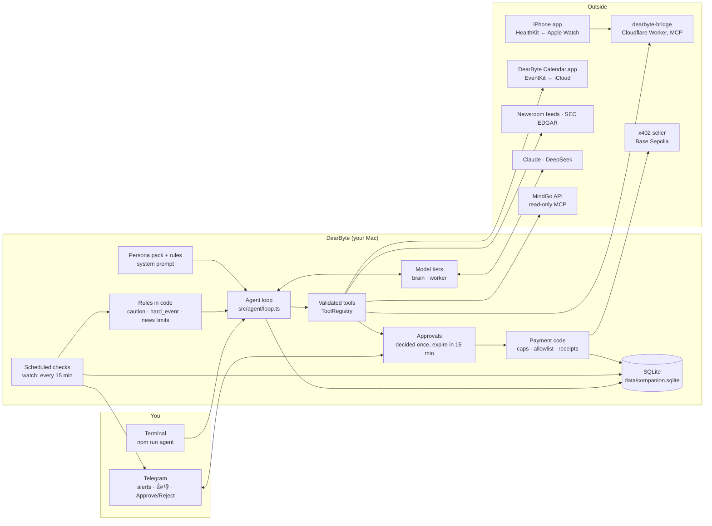

# Architecture

DearByte is a personal agent that runs on your own Mac. It knows you (health,
calendar, memory, money), watches for you (a morning brief, caution alerts,
company news), and spends for you, but only after you approve. This page
covers how the parts fit together, the rules the design follows, and what to
improve next.

## The big picture

For a detailed version, open [architecture.drawio](architecture.drawio) in
[diagrams.net](https://app.diagrams.net), the draw.io desktop app, or the
VS Code draw.io extension. It shows every layer of DearByte, the two MCP
servers it reads (MindGo for money, dearbyte-bridge for Apple Watch health
data), and how each one authenticates.

There are two products in one repository (the companion's pipeline is in
[how-it-works.md](how-it-works.md)). **The agent**, `npm run agent`, is
everything above. **The companion** is 小拜, a Chinese chat companion
(`npm run companion`, `npm run dearbyte` for WeChat). It came first and shares
the model layer, the store and memory. This page is about the agent.

## Principles

These hold everywhere in the code. A change that breaks one needs a good
reason written next to it.

1. **Code decides when, the model decides what to say.** Caution rules, calendar
   rules, news dedupe, quiet hours, daily limits and FIRE math are plain code
   with tests. The model writes the words and explains the numbers. It never
   decides whether to interrupt you, and it never does arithmetic about your
   money.
2. **The model can only propose.** Purchases become approval requests. Payment
   code runs after your yes, checks the caps again at that moment, and leaves a
   receipt. An approval is decided exactly once.
3. **Every tool call is validated.** Tool inputs are zod schemas. A model's
   arguments are untrusted output, and a tool never throws into the loop.
4. **Outside text is data, never instructions.** Calendar titles, news, filings,
   seller descriptions and tool results are marked as data in the prompt. The
   rules say so, and code quotes and cuts titles before they reach a prompt.
5. **The rules win over the persona.** The persona sets the tone. The rules
   file comes after it and wins. Persona packs are checked in CI.
6. **Secrets stay in `.env`, data stays in `data/`.** Both are ignored by Git.
   The MCP address, the bot token and the wallet key are never printed or
   logged.
7. **Cheap by default, capped always.** Brain and worker tiers, a per-run limit
   (8 steps, $0.50), a weekly cap, and a usage log of every call. The system
   prompt is identical on every request, so it stays in the provider's cache.

## Parts

| Part | Where | What it does |
| --- | --- | --- |
| Agent loop | `src/agent/loop.ts` | Asks the model, runs the tools it calls, repeats. Stops on a refusal, a cut-off tool call, the step or spend limit, or the weekly cap |
| Models | `src/agent/model.ts`, `tiers.ts`, `usage.ts` | Claude and DeepSeek through Anthropic's SDK. The **brain** writes and judges; the **worker** screens in bulk. Every call is priced and logged |
| Tools | `src/agent/tools.ts`, `toolset.ts` | The registry validates every call. `agentToolset` picks the tools from whatever is set up |
| Persona | `src/agent/persona.ts`, `personas/`, `prompts/agent/rules.en.md` | Persona pack + examples + rules → one cacheable system prompt |
| Scheduled checks | `src/agent/scheduled.ts`, `src/agent-cli.ts` (`watch`) | Brief at 07:30, caution checks every 15 minutes, news hourly; quiet hours 23:00–07:00; at most 3 cautions and 3 news messages a day |
| Health | `src/health/` | MCP client for dearbyte-bridge, daily snapshots, a 14-day baseline, caution rules (short sleep, high resting heart rate, low HRV) |
| Calendar | `src/calendar/`, `native/calendar/` | A small signed app reads EventKit, with its own macOS permission; `get_calendar`; the `hard_event` rule joins a health trigger |
| Watchlist | `src/watchlist/` | Newsroom RSS and SEC filings; the worker records a verdict per item; the brain writes one message; links come from stored items |
| Money | `src/finance/` | `finance.json`, FIRE math (`fire.ts`), the `fire_plan` tool, `npm run agent -- fire` |
| Wallet | `src/wallet/` | x402 v2 on Base Sepolia: quote → approval → fresh quote → reserve against the daily cap → EIP-3009 signature → receipt |
| Approvals | `src/agent/approvals.ts`, `src/telegram/inbox.ts` | Pending requests, Approve/Reject from Telegram or the terminal, 15-minute expiry, decided atomically |
| Telegram | `src/telegram/` | Bot API with long polling; only the configured chat is heard |
| Store | `src/storage/store.ts` | One SQLite file: messages, facts, settings, usage, health days, alerts, approvals, news items, purchases |

## How a morning brief happens

1. `watch` ticks after 07:30 local time, outside quiet hours, once a day.
2. Code reads last night's health summary from the bridge, saves the day, and
   compares it with your 14-day baseline.
3. If a health rule fired, code also checks today's calendar for something
   demanding (the `hard_event` rule).
4. The brain gets a fixed instruction, the checks that fired, and tools to read
   sleep, vitals, calendar and memory, and writes a short brief. Titles and
   other outside text are marked as data.
5. The brief is saved in `agent_alerts` before it's sent, then sent to Telegram
   with 👍/👎. Your rating is stored, and it's what Phase 2 measures.

## How a purchase happens

1. The model calls `propose_purchase`. Code asks the seller for its price and
   checks the allowlist, the per-purchase cap and the daily cap.
2. Code creates an approval, and Telegram shows it the way code wrote it:
   price, seller, recipient.
3. You tap Approve. Code gets a fresh quote. If the terms changed, it stops.
   Otherwise it reserves the amount against the daily cap, signs, pays, and
   stores the receipt with its transaction link.

## What to improve

Ranked by what they unlock. The first three make Phase 2's always-on,
measured use possible. The rest keep the code healthy as MindGo, more rules
and more channels arrive.

| # | Improvement | Why | Shape |
| --- | --- | --- | --- |
| 1 | **One `watch` at a time, as a service** | Two `watch` processes both send alerts and answer taps; a sleeping or crashed laptop stops everything silently | launchd job with `KeepAlive`; a lock file (reuse `src/lock.ts`); a heartbeat row each tick and a "no health data for 12 hours" alert |
| 2 | **A report command** | Phase 2's result is measured: precision, coverage, delay, cost, uptime | `npm run agent -- report` from `agent_alerts`, `watch_items`, `agent_usage` and the heartbeat; `/missed` in Telegram |
| 3 | **Connectors instead of if-chains** | Each data source is wired separately in `toolset.ts`, `status`, `watch` and the demo. MindGo would be the fourth copy | A `Connector` type: `status()`, `tools()`, optional `rules()` and `brief()` parts. Health, calendar, watchlist, finance and MindGo each become one. `toolset`, `status` and `watch` loop over the list |
| 4 | **One alert policy** | Quiet hours, daily caps, dedupe and "once a day per rule" live in `scheduled.ts` and again in `watchlist/check.ts`; money rules would add a third | A small policy module: every rule returns triggers, and one place applies quiet hours, caps, dedupe and storage |
| 5 | **Split `agent-cli.ts`** | 515 lines of wiring plus every command; `tools/demo.ts` repeats the wiring | `src/app.ts` builds the store, models, tools and channels once; `src/commands/*.ts` hold one command each; the demo reuses `app.ts` |
| 6 | **Split the store** | `store.ts` is 755 lines serving both the companion and the agent; schema changes are ad hoc | A repository per area (alerts, approvals, purchases, health, news), versioned migrations, and the same SQLite file |
| 7 | **Separate the agent's memory from the companion's** | The agent reads 小拜's facts; only `style` facts are filtered out | A memory namespace per product, or move the companion to DearByte-gf and give the agent its own memory |
| 8 | **Money through MindGo, read-only** (built: MindGo `POST /mcp`, DearByte `src/finance/mindgo.ts`) | FIRE used typed-in monthly numbers; MindGo already has real spending, terms and goals | A read-only MCP endpoint in MindGo with a revocable personal token; tools return term totals and goal progress, not raw transactions; `finance.json` keeps age and targets. Still open: MindGo is wired in `toolset.ts` like the others, so item 3 matters more now |
| 9 | **Scenario evals for personas and rules** | CI checks a pack's text, not how it behaves; alert wording has no regression test | A fixed set of scenarios (a caution, a purchase approval, a distressed user, a what-if about retiring) run against each persona with a cheap model, checked by code where possible |
| 10 | **Move the companion out** | Two products in one repo blur the pitch and the dependencies (WeChat automation, Accessibility) | Move 小拜 and `native/wechat-desktop` to DearByte-gf; share the model layer as a package if needed |

## Privacy boundaries

| Data | Stays on your Mac | Goes to the model provider | Goes elsewhere |
| --- | --- | --- | --- |
| Health | Daily summaries in `data/` | The numbers a request uses | Phone → your own Worker (dearbyte-bridge) |
| Calendar | Everything; only titles and times are read | Titles and times a request uses | — |
| Money | `finance.json` | The FIRE plan's numbers, and MindGo's term totals and goals, when a request uses them | DearByte reads totals from your own MindGo with a read-only token; no transactions or descriptions leave MindGo |
| Alerts and approvals | `data/` | — | Telegram's servers carry the messages |
| Wallet key | `.env` | Never | Signs only approved payments |
